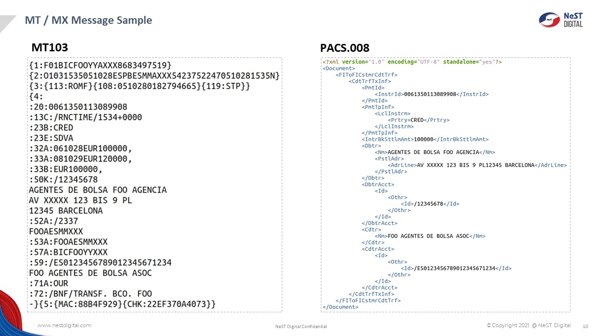
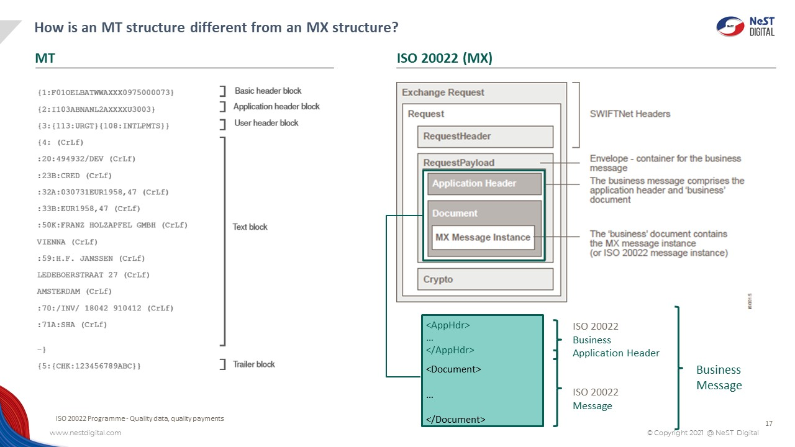

# NodeJS Microservice

RUN Command
````
```
| 1)Install Node_modules in Each Microservices |
```
````
````
```
| 2)docker-compose build |
```
````
````
```
| 3)docker-compose up  |
```
````

<H3> MT103 & Pac008 Format</H3>


<H3> MT-MX Structure</H3>

